# RFID Inventory Management System

A Raspberry Pi Pico W-based embedded inventory management system using RFID, a 4×4 matrix keypad, a 16×2 I2C LCD, and persistent Flash storage.

The system was developed as an academic embedded-systems project for **Digital Electronics III** at the **Universidad de Antioquia**, with the objective of implementing a small warehouse inventory controller capable of identifying users and products through RFID, managing warehouse capacity, processing inventory operations, and preserving inventory data across power interruptions.

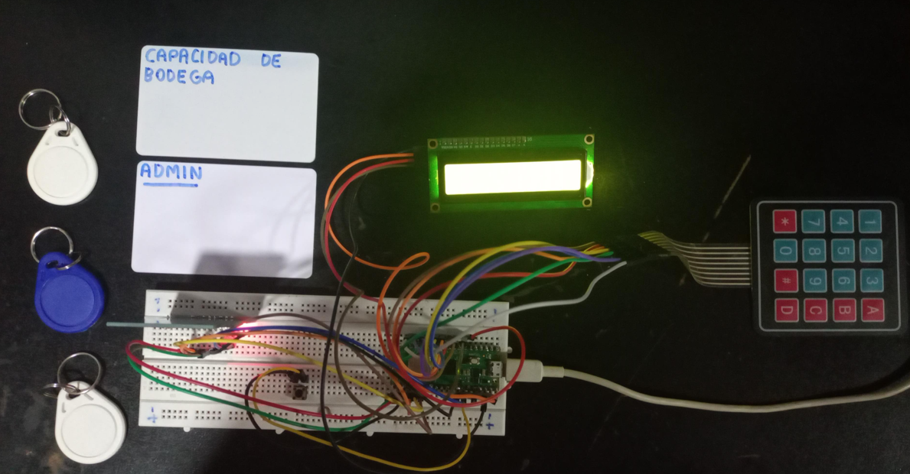

---

## Overview

This project turns a **Raspberry Pi Pico W** into the central controller of a small RFID-based warehouse inventory system.

The system combines several embedded interfaces and programming techniques:

* RFID communication through an **MFRC522** reader using SPI.
* MIFARE card authentication and block-level data access.
* A **4×4 matrix keypad** for user interaction.
* GPIO interrupts for keypad input.
* Software debounce for mechanical key presses.
* A **16×2 LCD** connected through an I2C interface.
* Persistent inventory storage using the RP2040's internal Flash memory.
* Administrative authentication using an RFID card and PIN.
* Warehouse capacity configuration stored on a dedicated RFID card.
* Product information stored directly on RFID tags.
* Inventory entry and removal operations.
* Inventory status visualization through the LCD.
* Inventory reset functionality.
* Polling-based peripheral handling combined with interrupt-driven keypad events.

The firmware is organized into dedicated modules for the RFID reader, keypad, LCD interface, and application-level inventory management.

---

## Project Context

The intended use case is a small warehouse in which products are represented by physical boxes carrying RFID tags.

Each product tag contains information that can be read by the controller, including:

| Field         | Description                                         |
| ------------- | --------------------------------------------------- |
| Product type  | Identifies one of five supported product categories |
| Quantity      | Number of units represented by the scanned tag      |
| Unit price    | Price associated with a single unit                 |
| Selling price | Selling price stored in the RFID tag                |

The warehouse capacity is configured independently through a dedicated RFID card. This allows the system to maintain a maximum inventory level for each of the five product types.

The system therefore separates three different kinds of RFID credentials:

| RFID element       | Purpose                                                      |
| ------------------ | ------------------------------------------------------------ |
| Administrator card | Grants access to the inventory system                        |
| Capacity card      | Provides maximum storage capacity for the five product types |
| Product tags       | Identify products and provide their stored product data      |

---

## Main Features

### Administrative authentication

The system begins in an unauthenticated state.

An administrator must first present a predefined RFID card. The card is identified through its UID.

After the RFID authentication succeeds, the system requests a four-digit PIN through the keypad.

Only after both stages are completed does the system grant access to the inventory-management functionality.

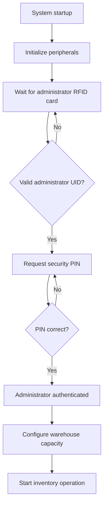
```mermaid
flowchart TD
    A[System startup] --> B[Initialize peripherals]
    B --> C[Wait for administrator RFID card]
    C --> D{Valid administrator UID?}
    D -- No --> C
    D -- Yes --> E[Request security PIN]
    E --> F{PIN correct?}
    F -- No --> E
    F -- Yes --> G[Administrator authenticated]
    G --> H[Configure warehouse capacity]
    H --> I[Start inventory operation]
```

The authentication mechanism is intended as an academic prototype rather than a production-grade security system. The current implementation stores the expected administrator UID and PIN in firmware.

---

## Warehouse Capacity Configuration

After successful administrator authentication, the system waits for a dedicated capacity RFID card.

The capacity card contains the maximum number of boxes that can be stored for each of the five supported product types.

The firmware:

1. Detects the RFID card.
2. Reads its UID.
3. Verifies that it corresponds to the configured capacity card.
4. Authenticates the appropriate MIFARE block using Key A.
5. Reads the block contents.
6. Extracts five capacity values.
7. Stores the capacities in the corresponding application variables.
8. Displays the configured capacity through the LCD.

The implementation extracts the capacity values from packed hexadecimal data stored in the MIFARE block.

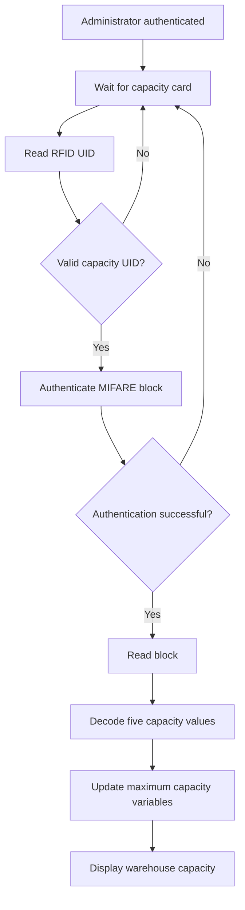
```mermaid
flowchart TD
    A[Administrator authenticated] --> B[Wait for capacity card]
    B --> C[Read RFID UID]
    C --> D{Valid capacity UID?}
    D -- No --> B
    D -- Yes --> E[Authenticate MIFARE block]
    E --> F{Authentication successful?}
    F -- No --> B
    F -- Yes --> G[Read block]
    G --> H[Decode five capacity values]
    H --> I[Update maximum capacity variables]
    I --> J[Display warehouse capacity]
```

---

## Product RFID Data

Product tags use MIFARE storage to carry product information.

The firmware reads a specific block from the tag and extracts the following fields:

```text
+----------------+-----------------------------+
| Field          | Stored representation       |
+----------------+-----------------------------+
| Product type   | 4-bit value                 |
| Quantity       | 12-bit value                |
| Unit price     | 16-bit value                |
| Selling price  | 16-bit value                |
+----------------+-----------------------------+
```

The implementation extracts the fields directly from the bytes returned by the MFRC522 driver.

Conceptually:

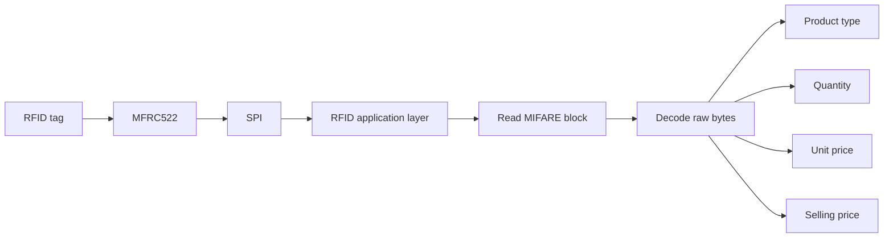
```mermaid
flowchart LR
    A[RFID tag] --> B[MFRC522]
    B --> C[SPI]
    C --> D[RFID application layer]
    D --> E[Read MIFARE block]
    E --> F[Decode raw bytes]
    F --> G[Product type]
    F --> H[Quantity]
    F --> I[Unit price]
    F --> J[Selling price]
```

The product type is converted into an application-level product name through `getProductName()`.

The current academic implementation supports five product types:

```text
Product 1
Product 2
Product 3
Product 4
Product 5
```

These labels can be replaced with application-specific product names without changing the underlying inventory mechanism.

---

# Inventory Operation

Once a product tag has been detected and its information decoded, the keypad is used to select the operation to perform.

| Key | Operation                              |
| --- | -------------------------------------- |
| `A` | Add product quantity to inventory      |
| `B` | Remove product quantity from inventory |
| `C` | Display current inventory              |
| `D` | Reset inventory                        |

The system displays these options on the LCD.

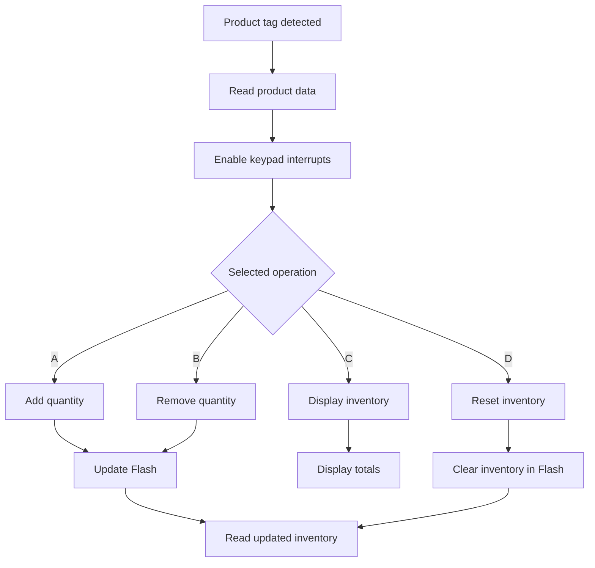
```mermaid
flowchart TD
    A[Product tag detected] --> B[Read product data]
    B --> C[Enable keypad interrupts]
    C --> D{Selected operation}

    D -->|A| E[Add quantity]
    D -->|B| F[Remove quantity]
    D -->|C| G[Display inventory]
    D -->|D| H[Reset inventory]

    E --> I[Update Flash]
    F --> I
    G --> J[Display totals]
    H --> K[Clear inventory in Flash]

    I --> L[Read updated inventory]
    K --> L
```

The same operation-selection interface also allows inventory inspection and reset.

---

# Persistent Inventory Storage

One of the main embedded-systems aspects of the project is that the current inventory is not kept exclusively in volatile RAM.

The RP2040's internal Flash memory is used to persist the quantity of each product type.

Five separate Flash sectors are reserved for the five product categories.

```text
Flash memory
┌───────────────────────────────────────────┐
│ Product Type 1 inventory                  │
├───────────────────────────────────────────┤
│ Product Type 2 inventory                  │
├───────────────────────────────────────────┤
│ Product Type 3 inventory                  │
├───────────────────────────────────────────┤
│ Product Type 4 inventory                  │
├───────────────────────────────────────────┤
│ Product Type 5 inventory                  │
└───────────────────────────────────────────┘
```

The storage locations are calculated from the configured Pico Flash size:

```c
#define FLASH_TARGET_OFFSET_TYPE1 \
    (PICO_FLASH_SIZE_BYTES - 5 * FLASH_SECTOR_SIZE)

#define FLASH_TARGET_OFFSET_TYPE2 \
    (PICO_FLASH_SIZE_BYTES - 4 * FLASH_SECTOR_SIZE)

#define FLASH_TARGET_OFFSET_TYPE3 \
    (PICO_FLASH_SIZE_BYTES - 3 * FLASH_SECTOR_SIZE)

#define FLASH_TARGET_OFFSET_TYPE4 \
    (PICO_FLASH_SIZE_BYTES - 2 * FLASH_SECTOR_SIZE)

#define FLASH_TARGET_OFFSET_TYPE5 \
    (PICO_FLASH_SIZE_BYTES - 1 * FLASH_SECTOR_SIZE)
```

This allows the application to maintain one persistent value per product type.

### Write process

When an inventory operation changes a product quantity, the firmware:

1. Determines the Flash sector associated with the product type.
2. Reads the current quantity.
3. Interprets an erased Flash value (`0xFFFFFFFF`) as zero.
4. Adds or subtracts the requested quantity.
5. Limits the result to the configured warehouse capacity.
6. Prevents the inventory from becoming negative.
7. Prepares a Flash page buffer.
8. Disables interrupts during the Flash erase/program operation.
9. Erases the corresponding Flash sector.
10. Programs the new inventory value.
11. Restores interrupts.

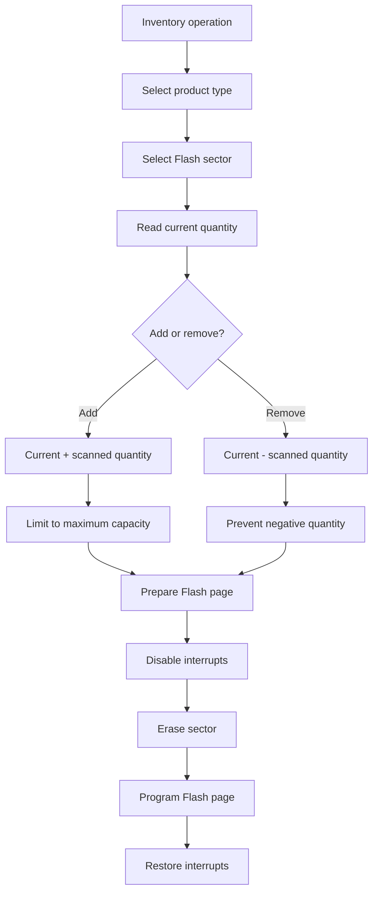
```mermaid
flowchart TD
    A[Inventory operation] --> B[Select product type]
    B --> C[Select Flash sector]
    C --> D[Read current quantity]
    D --> E{Add or remove?}

    E -->|Add| F[Current + scanned quantity]
    E -->|Remove| G[Current - scanned quantity]

    F --> H[Limit to maximum capacity]
    G --> I[Prevent negative quantity]

    H --> J[Prepare Flash page]
    I --> J

    J --> K[Disable interrupts]
    K --> L[Erase sector]
    L --> M[Program Flash page]
    M --> N[Restore interrupts]
```

This mechanism means that the inventory state can survive a normal power interruption because the stored quantity is kept in non-volatile memory.

---

# Inventory Constraints

The inventory logic enforces two important boundaries.

### Lower bound

Inventory quantities cannot become negative.

If a removal operation requests more units than currently exist, the implementation limits the resulting quantity to zero.

### Upper bound

Inventory quantities cannot exceed the configured capacity for their product type.

If an addition would exceed the configured maximum, the stored value is limited to the corresponding capacity.

This creates the following logical constraint:

```text
0 <= inventory[type] <= capacity[type]
```

The constraint is applied independently to each of the five product types.

---

# Keypad Module

The keypad is implemented as a dedicated module:

```text
pico_keypad4x4.c
pico_keypad4x4.h
```

It provides:

* GPIO initialization.
* Matrix configuration.
* Key mapping.
* Matrix scanning.
* GPIO interrupt configuration.
* Software debounce.

The matrix is represented by a 16-character lookup table:

```text
1  2  3  A
4  5  6  B
7  8  9  C
*  0  #  D
```

The application assigns the keypad pins as:

| Signal   | GPIO |
| -------- | ---: |
| Column 1 | GP10 |
| Column 2 | GP11 |
| Column 3 | GP12 |
| Column 4 | GP13 |
| Row 1    |  GP6 |
| Row 2    |  GP7 |
| Row 3    |  GP8 |
| Row 4    |  GP9 |

The module configures columns as inputs and rows as outputs.

### Matrix scanning

When a column transition is detected, the interrupt callback invokes the keypad scanning routine.

The scanning process:

1. Reads the column GPIO states.
2. Determines whether a key event exists.
3. Drives the rows low.
4. Activates one row at a time.
5. Waits briefly for the GPIO state to settle.
6. Reads the columns.
7. Determines the row/column intersection.
8. Maps the matrix position to the corresponding character.

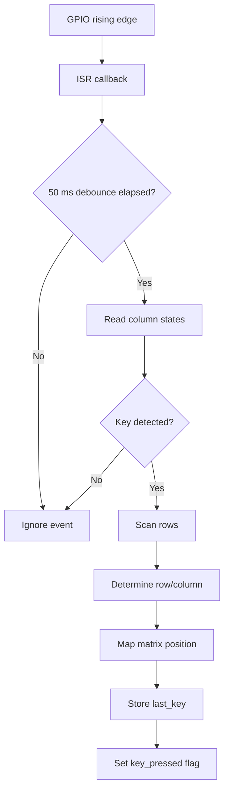
```mermaid
flowchart TD
    A[GPIO rising edge] --> B[ISR callback]
    B --> C{50 ms debounce elapsed?}
    C -- No --> D[Ignore event]
    C -- Yes --> E[Read column states]
    E --> F{Key detected?}
    F -- No --> D
    F -- Yes --> G[Scan rows]
    G --> H[Determine row/column]
    H --> I[Map matrix position]
    I --> J[Store last_key]
    J --> K[Set key_pressed flag]
```

### Debouncing

A 50 ms debounce interval is implemented using the RP2040 timing facilities:

```c
const uint DEBOUNCE_MS = 50;
```

The interrupt callback therefore does not immediately accept every GPIO transition as a new key press.

This prevents mechanical switch bouncing from generating multiple logical key events.

---

# Interrupt-Driven Input

The keypad module exposes:

```c
void pico_keypad_irq_enable(
    bool enable,
    gpio_irq_callback_t callback
);
```

The application can enable or disable keypad interrupts depending on the current operating state.

This is important because the system does not need keypad interrupts while performing RFID acquisition or other stages.

The application-level callback:

```c
void gpio_callback(uint gpio, uint32_t events)
```

performs the following operations:

1. Checks the debounce timer.
2. Calls `pico_keypad_get_key()`.
3. Stores the detected key in `last_key`.
4. Sets `key_pressed = true`.
5. Updates the debounce timestamp.

The main application loop can then wait for the event flag instead of continuously polling the keypad pins.

---

# LCD Module

The display is implemented through:

```text
lcd_1602_i2c.c
lcd_1602_i2c.h
```

The target is a standard **16×2 character LCD with an I2C bridge**, such as a PCF8574-based interface.

The LCD module provides functions for:

* Initialization.
* I2C byte transmission.
* LCD command transmission.
* Character transmission.
* String transmission.
* Cursor positioning.
* Display clearing.
* Enable-line timing.

The configured I2C address is:

```text
0x27
```

The default Pico I2C pins are used:

| Signal | Pico pin        |
| ------ | --------------- |
| SDA    | Default I2C SDA |
| SCL    | Default I2C SCL |

The application initializes the bus at:

```text
100 kHz
```

The LCD interface operates in 4-bit mode through the I2C expander.

Each LCD byte is split into a high nibble and a low nibble before being transmitted through the I2C bridge.

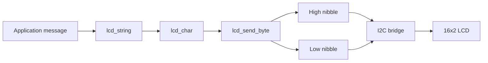
```mermaid
flowchart LR
    A[Application message] --> B[lcd_string]
    B --> C[lcd_char]
    C --> D[lcd_send_byte]
    D --> E[High nibble]
    D --> F[Low nibble]
    E --> G[I2C bridge]
    F --> G
    G --> H[16x2 LCD]
```

The application-level function `send_to_lcd()` adds another abstraction layer by receiving multiple text strings and presenting them two lines at a time.

It also centers each line according to the 16-character display width.

---

# MFRC522 RFID Driver

The RFID subsystem is implemented in:

```text
mfrc522.c
mfrc522.h
```

This is the most substantial low-level peripheral module in the project.

The driver provides an RP2040-compatible C implementation for interacting with the MFRC522 RFID reader.

It handles:

* SPI communication.
* MFRC522 register access.
* Register bit manipulation.
* CRC calculation.
* MFRC522 initialization.
* Antenna control.
* Card detection.
* Card selection.
* UID reading.
* MIFARE authentication.
* MIFARE block reads.
* MIFARE block writes.
* PICC commands.
* PCD commands.
* Communication status handling.
* Timeouts and error conditions.

The driver exposes the MFRC522 registers and command definitions through the header file, including the register map and PCD command enumerations.

---

## MFRC522 SPI Interface

The RFID reader is connected through SPI.

The implementation uses:

| Signal      | GPIO |
| ----------- | ---: |
| SCK         | GP18 |
| MOSI        | GP19 |
| MISO        | GP16 |
| Chip Select | GP17 |
| Reset       | GP20 |

The SPI configuration used by the driver is:

```text
Clock:      1 MHz
Data size:  8 bits
CPOL:       0
CPHA:       0
Bit order:  MSB first
```

The driver directly performs register-level SPI transactions.

For example, register writes are performed by constructing the appropriate SPI message, asserting chip select, transmitting the bytes, and then releasing chip select.

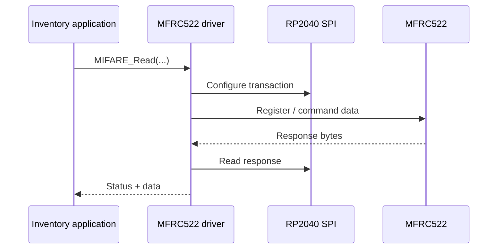
```mermaid
sequenceDiagram
    participant APP as Inventory application
    participant RFID as MFRC522 driver
    participant SPI as RP2040 SPI
    participant CHIP as MFRC522

    APP->>RFID: MIFARE_Read(...)
    RFID->>SPI: Configure transaction
    RFID->>CHIP: Register / command data
    CHIP-->>RFID: Response bytes
    RFID->>SPI: Read response
    RFID-->>APP: Status + data
```

---

# MFRC522 Driver Architecture

The driver uses an abstracted MFRC522 instance structure:

```c
MFRC522Ptr_t
```

The initialization function creates and returns a pointer to the configured driver instance.

The driver then uses this object to maintain information such as:

* SPI peripheral.
* Chip-select pin.
* Receive buffer.
* Transmit buffer.
* RFID UID information.
* Communication state.

At the lowest level, functions such as:

```text
PCD_WriteRegister()
PCD_WriteNRegister()
PCD_ReadRegister()
PCD_ReadNRegister()
PCD_SetRegisterBitMask()
PCD_ClearRegisterBitMask()
```

provide register-level access to the MFRC522.

Higher-level functions build upon those primitives to implement card communication and MIFARE operations.

---

# MIFARE Card Handling

The application uses the MFRC522 driver to communicate with MIFARE cards and tags.

The general interaction is:

```text
Detect card
    ↓
Select card
    ↓
Read UID
    ↓
Validate UID when required
    ↓
Authenticate MIFARE block
    ↓
Read block
    ↓
Decode application data
```

The application uses Key A authentication with the default MIFARE key for the configured data blocks.

For product tags, the RFID data is interpreted at the application level after the raw 16-byte block has been read.

This separation is useful because the MFRC522 driver is responsible for RFID communication, while `inventory.h` is responsible for understanding what the bytes mean in the context of the warehouse application.

---

# Polling and Interrupts

The project combines two embedded input-handling strategies.

### Polling

Polling is used extensively for RFID operations.

For example, the application waits for a new RFID card through calls such as:

```c
while (!PICC_IsNewCardPresent(mfrc522));
```

This is appropriate for the application because RFID operations are sequential and the system is intentionally waiting for a user to present a card.

### Interrupts

The keypad uses GPIO interrupts.

A rising edge on one of the keypad column inputs invokes the configured callback.

The callback identifies the key and sets an application-level event flag.

This results in a hybrid architecture:

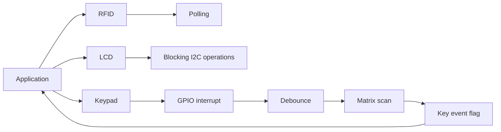
```mermaid
flowchart LR
    A[Application] --> B[RFID]
    A --> C[LCD]
    A --> D[Keypad]

    B --> E[Polling]
    C --> F[Blocking I2C operations]
    D --> G[GPIO interrupt]

    G --> H[Debounce]
    H --> I[Matrix scan]
    I --> J[Key event flag]
    J --> A
```

This approach was chosen as part of the embedded-systems exercise to demonstrate both polling and interrupt-driven peripheral interaction.

---

# Application Module

The application logic is mainly contained in:

```text
inventory.c
inventory.h
```

The project intentionally keeps the main program entry point in `inventory.c`, while the application-specific functions and global state are declared and implemented through `inventory.h`.

The application module coordinates:

* Peripheral initialization.
* Administrator authentication.
* PIN handling.
* RFID capacity configuration.
* Product-tag processing.
* Operation selection.
* Inventory storage.
* Inventory inspection.
* Inventory reset.
* LCD feedback.

The main program initializes the peripherals and then executes the application workflow.

---

# Main Program Flow

The complete system sequence is:

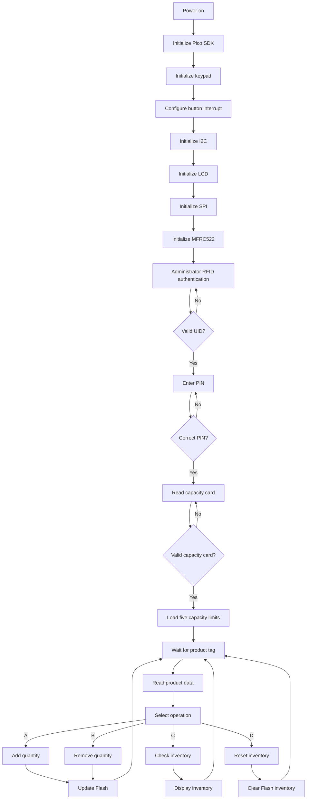
```mermaid
flowchart TD
    A[Power on] --> B[Initialize Pico SDK]
    B --> C[Initialize keypad]
    C --> D[Configure button interrupt]
    D --> E[Initialize I2C]
    E --> F[Initialize LCD]
    F --> G[Initialize SPI]
    G --> H[Initialize MFRC522]

    H --> I[Administrator RFID authentication]
    I --> J{Valid UID?}
    J -- No --> I
    J -- Yes --> K[Enter PIN]

    K --> L{Correct PIN?}
    L -- No --> K
    L -- Yes --> M[Read capacity card]

    M --> N{Valid capacity card?}
    N -- No --> M
    N -- Yes --> O[Load five capacity limits]

    O --> P[Wait for product tag]
    P --> Q[Read product data]
    Q --> R[Select operation]

    R -->|A| S[Add quantity]
    R -->|B| T[Remove quantity]
    R -->|C| U[Check inventory]
    R -->|D| V[Reset inventory]

    S --> W[Update Flash]
    T --> W
    U --> X[Display inventory]
    V --> Y[Clear Flash inventory]

    W --> P
    X --> P
    Y --> P
```

---

# Hardware Architecture

The complete system consists of the following main hardware blocks:

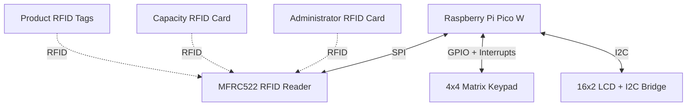
```mermaid
flowchart TB
    PICO[Raspberry Pi Pico W]

    RFID[MFRC522 RFID Reader]
    KEYPAD[4x4 Matrix Keypad]
    LCD[16x2 LCD + I2C Bridge]
    ADMIN[Administrator RFID Card]
    CAPACITY[Capacity RFID Card]
    TAGS[Product RFID Tags]

    PICO <-->|SPI| RFID
    PICO <-->|GPIO + Interrupts| KEYPAD
    PICO <-->|I2C| LCD

    ADMIN -. RFID .-> RFID
    CAPACITY -. RFID .-> RFID
    TAGS -. RFID .-> RFID
```

---

# Hardware Summary

| Component              | Role                             | Interface       |
| ---------------------- | -------------------------------- | --------------- |
| Raspberry Pi Pico W    | Main controller                  | —               |
| MFRC522                | RFID reader and MIFARE interface | SPI             |
| MIFARE RFID cards/tags | Authentication and data storage  | RF              |
| 4×4 keypad             | User input                       | GPIO            |
| 16×2 LCD               | User feedback                    | I2C             |
| RP2040 internal Flash  | Persistent inventory storage     | Internal memory |

---

# GPIO Assignment

The project uses the following relevant GPIO assignments.

| GPIO | Function                        |
| ---: | ------------------------------- |
|  GP6 | Keypad row 1                    |
|  GP7 | Keypad row 2                    |
|  GP8 | Keypad row 3                    |
|  GP9 | Keypad row 4                    |
| GP10 | Keypad column 1                 |
| GP11 | Keypad column 2                 |
| GP12 | Keypad column 3                 |
| GP13 | Keypad column 4                 |
| GP16 | MFRC522 MISO                    |
| GP17 | MFRC522 chip select             |
| GP18 | MFRC522 SCK                     |
| GP19 | MFRC522 MOSI                    |
| GP20 | MFRC522 reset                   |
| GP28 | Additional reset/control button |

The LCD uses the Pico SDK's default I2C pins rather than explicitly assigning the SDA/SCL GPIO numbers in the application.

---

# Software Architecture

The firmware is divided into four main functional layers.

```text
┌──────────────────────────────────────────────┐
│              Application Layer               │
│                                              │
│ inventory.c / inventory.h                    │
│ Authentication, inventory, workflow, UI      │
└───────────────────────┬──────────────────────┘
                        │
        ┌───────────────┼────────────────┐
        │               │                │
        ▼               ▼                ▼
┌──────────────┐ ┌──────────────┐ ┌──────────────┐
│ RFID Module  │ │ Keypad Module│ │  LCD Module  │
│              │ │              │ │              │
│ mfrc522.c/h  │ │ pico_keypad  │ │ lcd_1602     │
│              │ │ 4x4.c/h      │ │ _i2c.c/h     │
└──────┬───────┘ └──────┬───────┘ └──────┬───────┘
       │                │                │
       ▼                ▼                ▼
      SPI              GPIO             I2C
```

---

# Module Reference

## `inventory.c`

Application entry point.

Responsibilities include:

* Starting the Pico SDK standard I/O.
* Calling application setup routines.
* Initializing the keypad.
* Configuring the additional button.
* Initializing I2C.
* Initializing the LCD.
* Starting the administrator authentication sequence.
* Managing the main application workflow.

The file contains the documented Doxygen main page and serves as the main entry point of the firmware.

---

## `inventory.h`

Despite its `.h` extension, this file contains a substantial portion of the application implementation.

It contains:

* Global application state.
* Pin definitions.
* Flash address definitions.
* Product capacity variables.
* Inventory totals.
* RFID authentication routines.
* Capacity-card processing.
* Product-tag decoding.
* Flash storage routines.
* Inventory reset.
* Operation selection.
* LCD presentation helpers.
* Inventory display functions.

Important functions include:

| Function                             | Purpose                               |
| ------------------------------------ | ------------------------------------- |
| `setup()`                            | Initializes SPI and MFRC522           |
| `admin_card_authentication()`        | Validates administrator RFID UID      |
| `gpio_callback()`                    | Processes keypad interrupt events     |
| `send_to_lcd()`                      | Displays application messages         |
| `readMaxProductsFromSector2Block2()` | Reads warehouse capacity              |
| `readProductInfoFromSector4Block2()` | Reads product-tag data                |
| `load_to_flash()`                    | Updates persistent inventory          |
| `read_all_types()`                   | Reads all stored inventory quantities |
| `reset_inventory()`                  | Clears inventory                      |
| `select_mode()`                      | Processes A/B/C/D operation selection |
| `send_capacity_to_lcd()`             | Displays configured capacities        |
| `check_inventory()`                  | Displays current inventory            |

---

## `mfrc522.c / mfrc522.h`

Low-level RFID driver.

Responsibilities include:

* MFRC522 initialization.
* SPI transactions.
* Register access.
* Register bit manipulation.
* CRC calculation.
* RFID card detection.
* Card selection.
* UID handling.
* MIFARE authentication.
* MIFARE read/write operations.
* PCD/PICC command handling.

The driver is an adaptation of existing MFRC522 C/Arduino implementations and is credited in the source code to Benjamin Modica, Miguel Balboa, and the intermediate adaptation it derives from.

The project does not present this driver as entirely original code.

---

## `pico_keypad4x4.c / pico_keypad4x4.h`

Keypad driver.

Responsibilities include:

* GPIO configuration.
* Matrix initialization.
* Matrix scanning.
* Key mapping.
* Debounce timing.
* GPIO interrupt configuration.

The module exposes a small interface that allows the application to initialize the keypad, retrieve the currently detected key, and enable or disable GPIO interrupts.

The keypad uses a 4×4 matrix and is represented internally as a 16-element character map.

---

## `lcd_1602_i2c.c / lcd_1602_i2c.h`

LCD interface.

Responsibilities include:

* I2C byte transmission.
* LCD initialization.
* 4-bit data transmission through the I2C bridge.
* Cursor positioning.
* Character and string output.
* Display clearing.
* Enable-line timing.

The implementation is based on Raspberry Pi Pico example code for driving a 16×2 LCD through an I2C bridge. The source file retains the original Raspberry Pi copyright and BSD-3-Clause SPDX notice.

---

# RFID Memory Organization

The project uses specific MIFARE blocks for application data.

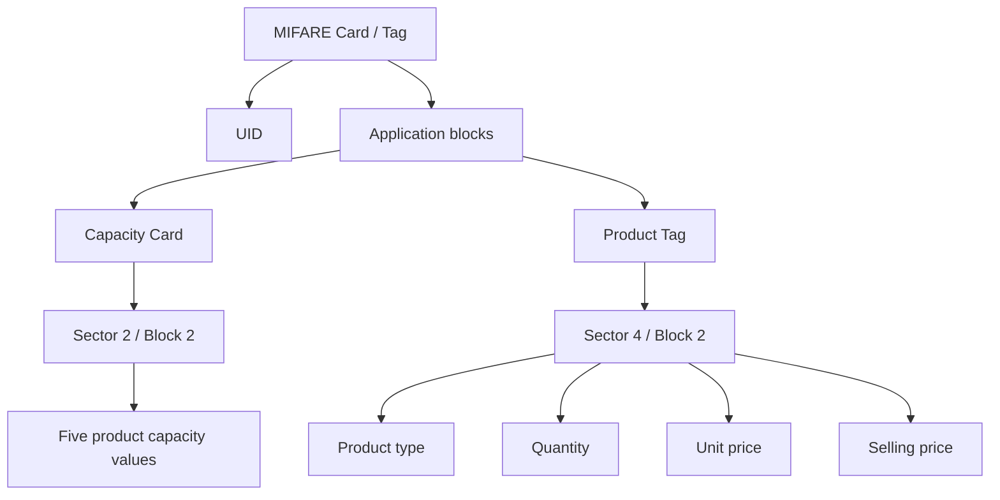
```mermaid
flowchart TD
    A[MIFARE Card / Tag] --> B[UID]
    A --> C[Application blocks]

    C --> D[Capacity Card]
    C --> E[Product Tag]

    D --> F[Sector 2 / Block 2]
    F --> G[Five product capacity values]

    E --> H[Sector 4 / Block 2]
    H --> I[Product type]
    H --> J[Quantity]
    H --> K[Unit price]
    H --> L[Selling price]
```

This arrangement allows the same RFID technology to represent different application-level entities.

---

# User Interaction

The LCD acts as the primary feedback interface.

The keypad provides control commands.

A simplified interaction sequence is:

```text
1. Welcome message
2. Request administrator RFID card
3. Validate UID
4. Request PIN
5. Validate PIN
6. Request capacity card
7. Read warehouse capacity
8. Display capacity
9. Wait for product tag
10. Read product information
11. Select operation
12. Update or display inventory
13. Return to product-tag scanning
```

The LCD output is handled through `send_to_lcd()`, which supports groups of two lines and automatically centers the displayed strings on the 16-character display.

---

# Error and Boundary Handling

The implementation includes several checks during normal operation.

### RFID validation

Different RFID credentials are identified by UID before their data is processed.

### MIFARE authentication

Data blocks are authenticated before being read.

### Invalid product type

Unknown product codes are mapped to:

```text
Producto Desconocido
```

### Inventory underflow

Removing more inventory than currently stored does not allow the resulting value to become negative.

### Inventory overflow

Adding inventory beyond the configured capacity limits the stored quantity to the maximum allowed value.

### Empty Flash

An erased Flash word (`0xFFFFFFFF`) is interpreted as an initial inventory value of zero.

### Keypad debounce

Key events occurring within the debounce interval are ignored.

---

# Documentation

The project includes generated **Doxygen documentation** under:

```text
inventory/doc/html/
```

The documentation contains descriptions of the main application, modules, functions, circuit information, libraries, notes, and authorship.

The generated documentation can be accessed from:

```text
inventory/doc/html/index.html
```

This documentation complements the README by providing source-level API documentation.

---

# Repository Structure

```text
RP2024-RFID-Inventory-System/
│
├── inventory/
│   │
│   ├── .vscode/
│   │
│   ├── build/
│   │
│   ├── doc/
│   │   └── html/
│   │
│   ├── CMakeLists.txt
│   ├── inventory.c
│   ├── inventory.h
│   │
│   ├── lcd_1602_i2c.c
│   ├── lcd_1602_i2c.h
│   │
│   ├── mfrc522.c
│   ├── mfrc522.h
│   │
│   ├── pico_keypad4x4.c
│   ├── pico_keypad4x4.h
│   │
│   └── pico_sdk_import.cmake
│
├── media/
│   ├── Circuito Comp.png
│   ├── Circuito Comp2.jpeg
│   ├── Circuito RFID.jpeg
│   ├── Circuito Raspberry.jpeg
│   ├── Circuito TAGS y tarjetas.jpeg
│   ├── Circuito teclado M.jpeg
│   ├── Citcuito LCD.jpeg
│   ├── Items tags.jpeg
│   ├── LCD cod.png
│   ├── Secciones.jpeg
│   └── Tarjetas y tags.jpeg
│
├── flowcharts/
│   ├── Diagrama de flujo General.png
│   ├── LCD.png
│   ├── Modulo MRFC522.png
│   ├── inventory.png
│   └── keypad.png
│
├── .gitignore
├── LICENSE
└── README.md
```

> The media and flowchart filenames above correspond to the files currently visible in the repository tree. If the latest filename-renaming commit is not yet reflected by GitHub, update these relative paths after pushing the rename commit.

---

# Build System

The project uses **CMake** and the **Raspberry Pi Pico SDK**.

The configured board target is:

```cmake
set(PICO_BOARD "pico_w")
```

The executable is built from:

```cmake
add_executable(
    inventory
    inventory.c
    mfrc522.c
    pico_keypad4x4.c
)
```

The build links against Pico SDK components including:

* `pico_stdlib`
* `pico_flash`
* `pico_binary_info`
* `pico_cyw43_arch_none`
* `pico_stdio_usb`
* `hardware_gpio`
* `hardware_flash`
* `hardware_i2c`
* `hardware_spi`
* `hardware_timer`
* `hardware_pwm`
* `hardware_irq`
* `hardware_sync`

USB serial output is enabled while UART output is disabled.

The build system also generates the standard Pico output formats:

* ELF
* BIN
* HEX
* UF2

---

# Building the Firmware

A standard Pico SDK build can be performed from the `inventory` directory.

Example:

```bash
mkdir build
cd build
cmake ..
cmake --build .
```

The resulting firmware files are generated inside the build directory.

The UF2 firmware can then be copied to the Raspberry Pi Pico W using the standard Raspberry Pi Pico bootloader procedure.

---

# Serial Output

USB serial output is used extensively during development and debugging.

The firmware prints information such as:

* RFID detection.
* UID values.
* Authentication status.
* MIFARE communication results.
* Product information.
* Inventory quantities.
* Keypad events.
* Flash operations.
* Error messages.

This provides a second diagnostic interface in addition to the LCD.

The LCD is intended for user interaction, while USB serial output is useful for development and troubleshooting.

---

# Development Approach

The system was developed incrementally around the individual peripherals.

The main development stages were:

1. Establish the Raspberry Pi Pico development environment.
2. Test the RFID hardware and MIFARE cards.
3. Test the LCD interface.
4. Implement the keypad matrix.
5. Add keypad interrupt handling.
6. Integrate the peripherals.
7. Implement RFID authentication.
8. Implement product-data decoding.
9. Implement warehouse-capacity handling.
10. Implement persistent inventory storage.
11. Integrate the complete application workflow.
12. Test inventory addition, removal, inspection, and reset.

The MFRC522 subsystem represented the most involved part of the project because it required understanding both the reader's low-level registers and the higher-level MIFARE card communication sequence.

---

# Technical Challenges

## MFRC522 integration

The RFID subsystem required understanding the relationship between:

```text
RP2040 SPI
      ↓
MFRC522 registers
      ↓
PCD commands
      ↓
PICC communication
      ↓
MIFARE authentication
      ↓
MIFARE memory blocks
```

This required substantially more low-level interaction than the keypad or LCD.

The driver therefore provides an important learning component of the project: moving from a high-level Arduino-oriented RFID library model to an RP2040 C SDK implementation.

---

## Persistent Flash storage

Using internal Flash for application data required handling:

* sector alignment;
* erased Flash values;
* Flash erase operations;
* page programming;
* memory-mapped Flash access;
* interrupt control during Flash modification.

The implementation reserves dedicated sectors near the end of the configured Flash space for inventory data.

---

## Interrupt-driven keypad

The keypad combines matrix scanning with GPIO interrupts.

The interrupt does not simply identify the key directly from the edge event. Instead, it triggers the matrix scanning procedure, which determines the active row and column.

The implementation also introduces debounce timing to avoid registering multiple events from a single mechanical key press.

---

# Testing and Debugging

The system provides two complementary feedback channels.

### LCD

Used for operator-facing messages:

* Authentication prompts.
* PIN prompts.
* Capacity information.
* Product operation selection.
* Inventory quantities.
* Operation feedback.
* Reset notifications.

### USB serial

Used for engineering diagnostics:

* UID inspection.
* RFID communication status.
* Raw MIFARE block contents.
* Product data.
* Inventory values.
* Keypad events.
* Error reporting.

This separation made it possible to troubleshoot low-level peripheral behavior without relying exclusively on the LCD.

---

# Hardware Documentation

## Complete system


## RFID subsystem

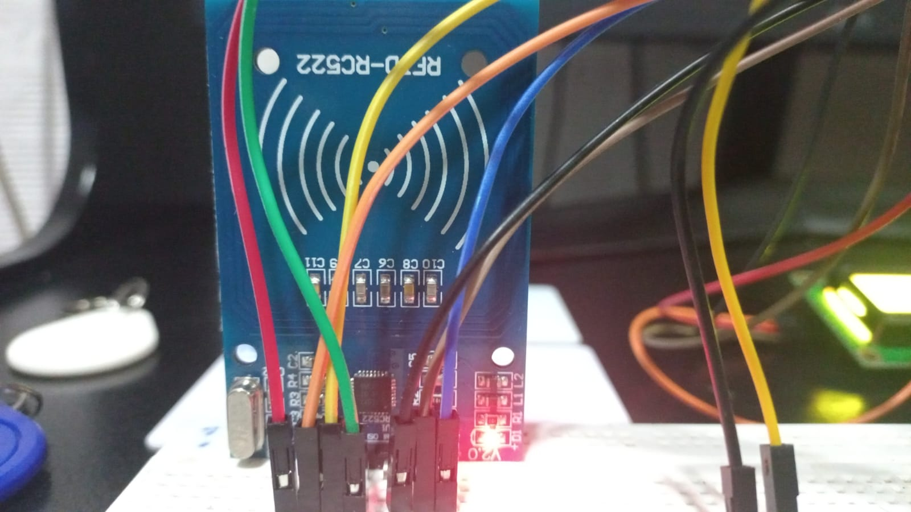

## Raspberry Pi Pico

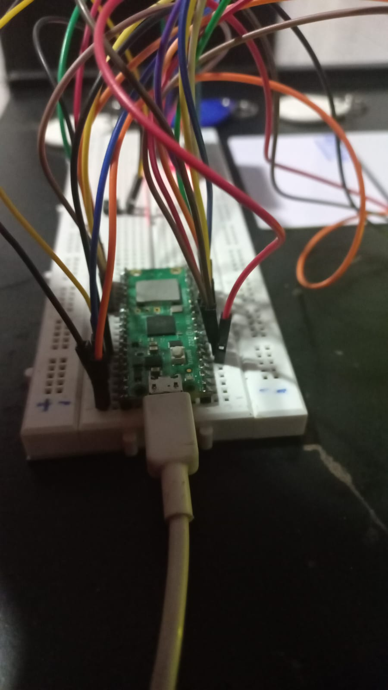

## RFID cards and tags

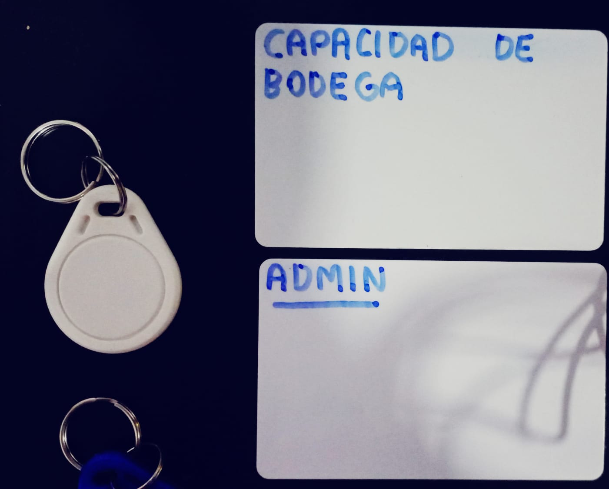

## Keypad

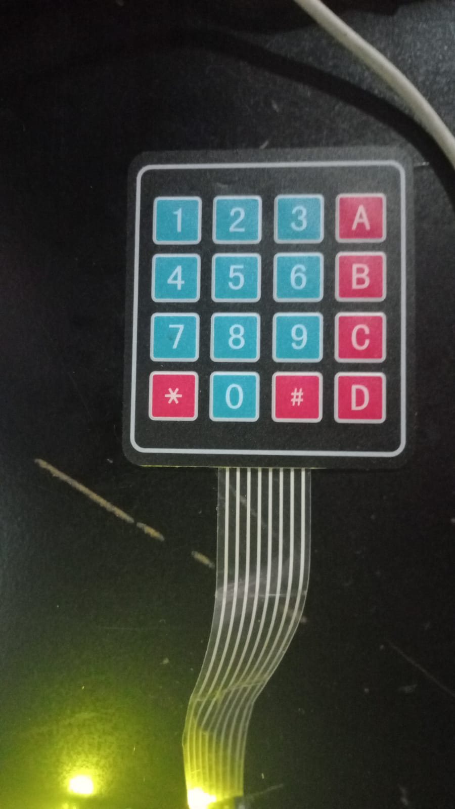

## LCD

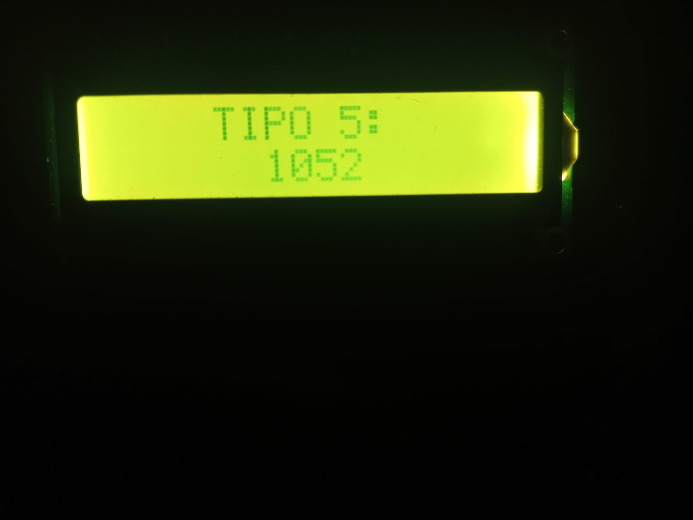

## Product tags

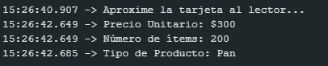

## RFID memory organization

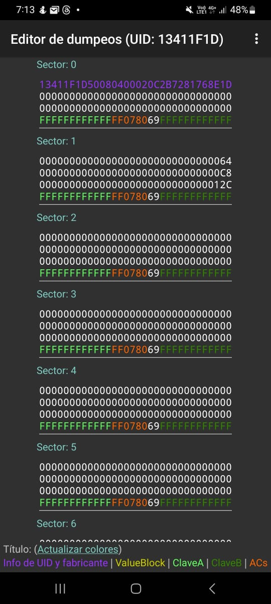

---

# Flowcharts

The repository also contains the original subsystem flowcharts used during development.

## General System Flow

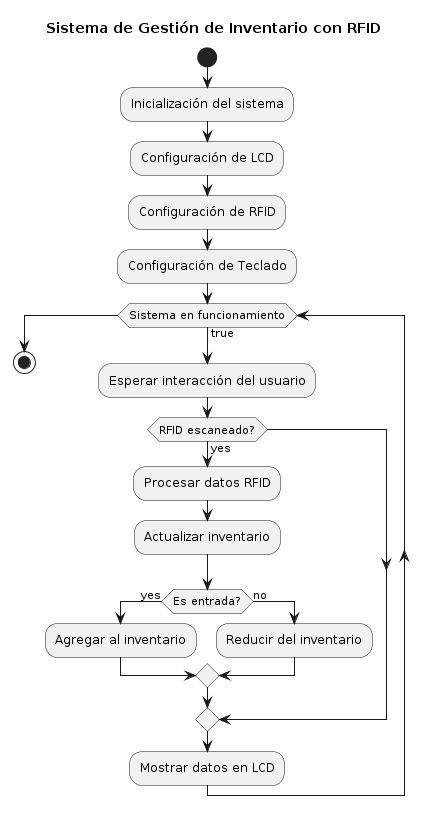

## Inventory Module

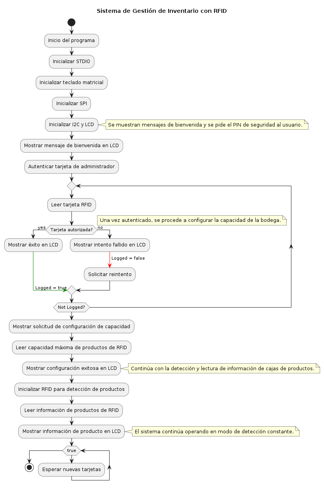

## RFID Module

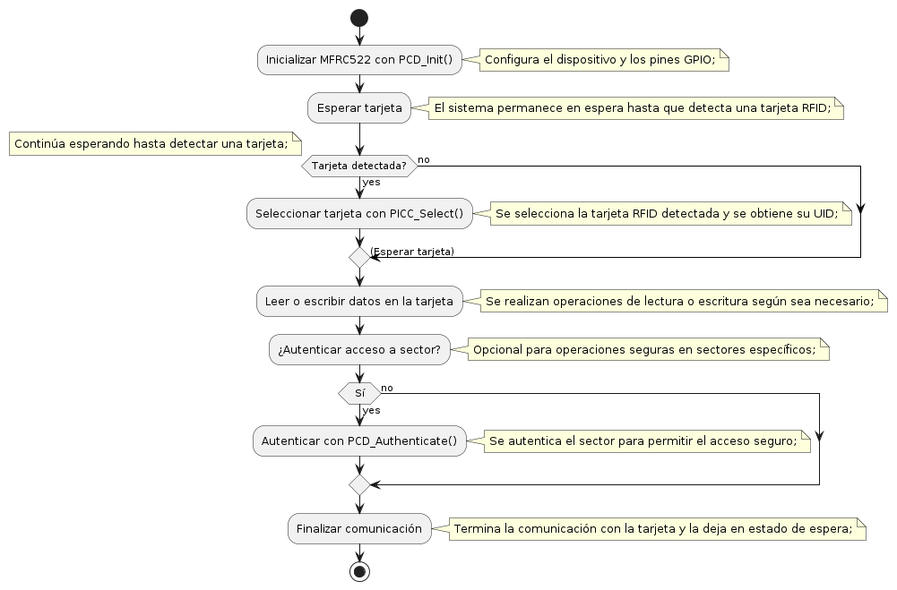

## Keypad Module

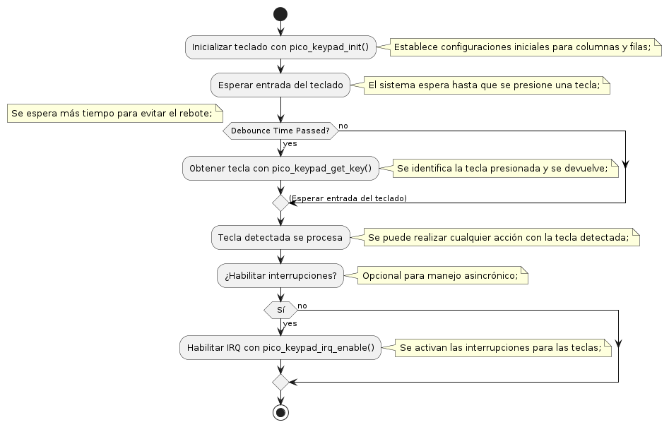

## LCD Module

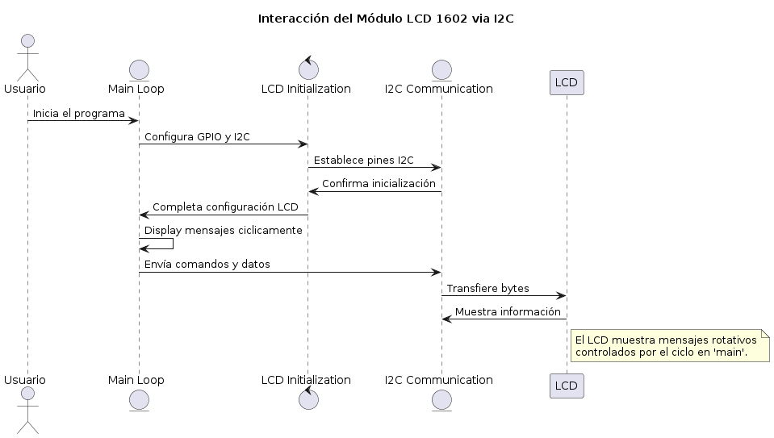


The Mermaid diagrams in this README provide a compact architectural representation, while these original flowcharts document the design work produced during the project.

---

# Source and Third-Party Components

Not every source file in this repository was written from scratch.

The project contains adaptations of existing embedded libraries and examples, particularly for the MFRC522 RFID reader and the I2C LCD.

## MFRC522

The `mfrc522.c/.h` implementation explicitly identifies itself as an adaptation of existing C and Arduino MFRC522 libraries.

The source credits:

* Benjamin Modica
* Luis Fernando García's intermediate C implementation
* Miguel Balboa's original Arduino RFID library

The original licensing and attribution information included in the source files should be preserved when redistributing the corresponding driver code.

## LCD

The LCD implementation is based on Raspberry Pi Pico example code for driving a 16×2 LCD through an I2C bridge.

The original source file retains the Raspberry Pi copyright notice and BSD-3-Clause SPDX identifier.

## Keypad

The keypad module was developed as a course-specific library for matrix keypad handling and adapted for this application.

---

# Project Documentation

Additional documentation is available in:

```text
inventory/doc/html/
```

The generated Doxygen documentation contains source-level descriptions of the application and its functions.

---

# Project Authors

**Santiago Giraldo Tabares**
**Ana María Velasco Montenegro**

Universidad de Antioquia
Department of Electronics and Telecommunications Engineering
Digital Electronics III

Project developed in 2024.

---

# License

The repository includes an MIT License for the project.

Third-party components and adapted source code remain subject to their respective original licenses and attribution requirements.

When redistributing the project, preserve the relevant third-party notices contained in the source files.

---

# Engineering Summary

This project combines several embedded-systems concepts into a single working application:

| Area                 | Implementation                |
| -------------------- | ----------------------------- |
| MCU                  | Raspberry Pi Pico W / RP2040  |
| Programming language | C                             |
| Build system         | CMake + Raspberry Pi Pico SDK |
| RFID                 | MFRC522                       |
| RFID protocol        | MIFARE                        |
| RFID interface       | SPI                           |
| Display              | 16×2 character LCD            |
| Display interface    | I2C                           |
| User input           | 4×4 matrix keypad             |
| Input handling       | GPIO interrupts + polling     |
| Debouncing           | Software, 50 ms               |
| Persistent storage   | RP2040 internal Flash         |
| Authentication       | RFID UID + PIN                |
| Application data     | RFID MIFARE blocks            |
| Inventory categories | 5 product types               |
| Debugging            | USB serial + LCD              |
| Documentation        | Doxygen                       |

---

# Key Embedded-Skills Demonstrated

This project demonstrates practical experience with:

* Embedded C development.
* Raspberry Pi Pico SDK.
* RP2040 peripherals.
* SPI communication.
* I2C communication.
* GPIO configuration.
* GPIO interrupts.
* Matrix keypad scanning.
* Software debounce.
* RFID communication.
* MIFARE card authentication.
* RFID UID processing.
* Binary data extraction from raw byte buffers.
* Flash memory management.
* Persistent state management.
* Embedded user interfaces.
* Modular firmware organization.
* CMake-based embedded builds.
* Hardware/software integration.
* Embedded debugging through serial output.

The project is particularly representative of a system where multiple hardware interfaces must operate together under a single application-level state machine rather than as isolated peripheral demonstrations.
